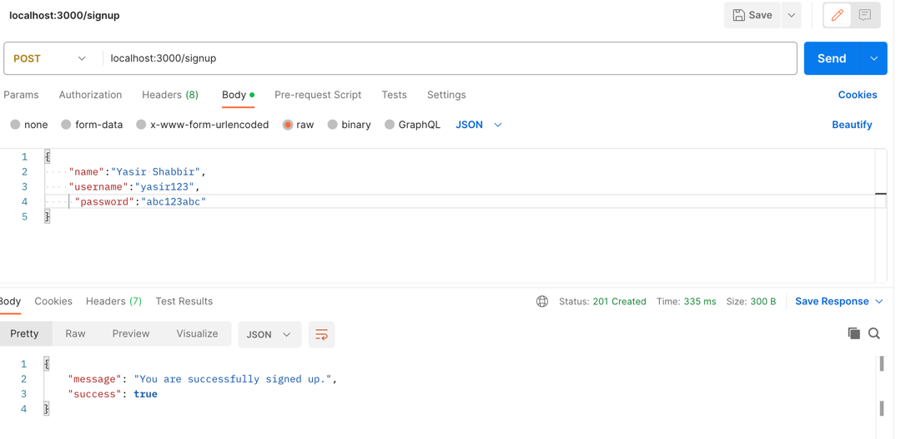
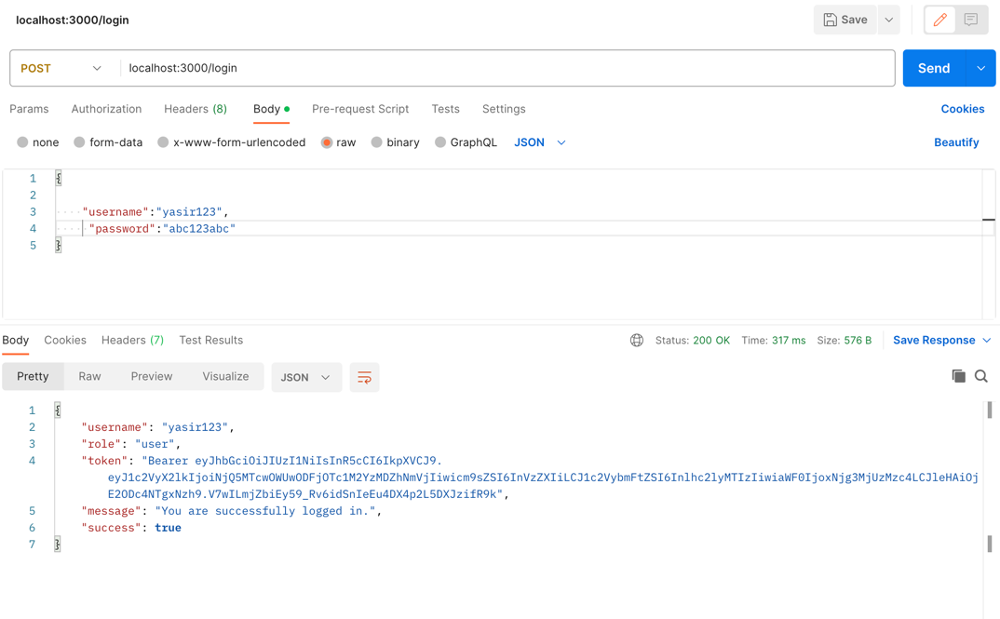
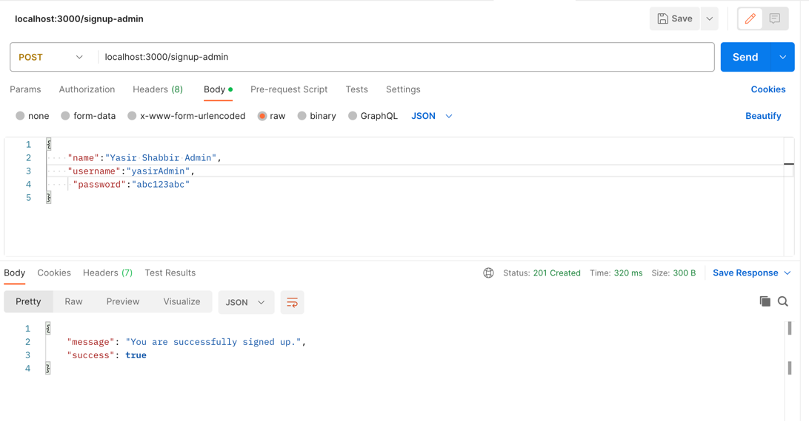
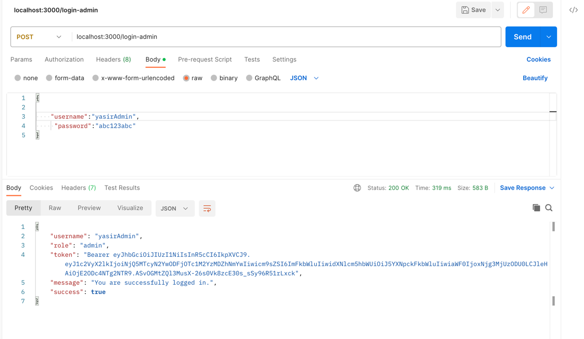
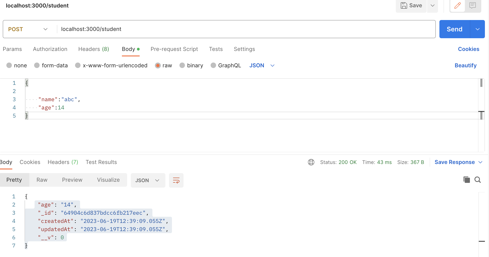
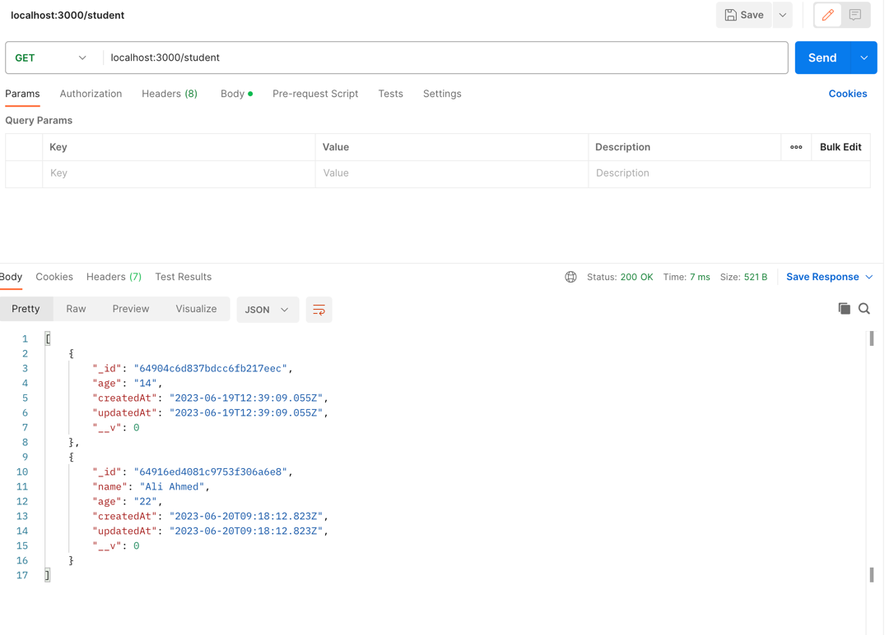

# Online Backend Tuition Managment Application

Build a Restful API for Online Tuition system  using Node.js, Express and MongoDB. In this application user can register course and course can have multiple students.

### Technology used
* NodeJS
* Express
* MongoDB
* Mongeese
* Bycrypt
* JWT
* JIO validation


## Steps to Setup

1. Install dependencies

```bash
npm install
```

2. Run Server

```bash
node server.js
```

You can browse the apis at <http://localhost:3000>


## API usage

#### *Request URL for Registration or Signup User

`curl --location 'localhost:3000/signup' \
--header 'Content-Type: application/json' \
--data '{
"name":"Yasir Shabbir",
"username":"yasir123",
"password":"abc123abc"
}'`


#### *Request URL for Login

`curl --location 'localhost:3000/login' \
--header 'Content-Type: application/json' \
--data '{
    "username":"yasir123",
     "password":"abc123abc"
}'`




#### *Request URL for Registration or Signup for ADMIN User

`curl --location 'localhost:3000/signup-admin' \
--header 'Content-Type: application/json' \
--data '{
"name":"Yasir Shabbir Admin",
"username":"yasirAdmin",
"password":"abc123abc"
}'`



#### *Request URL for ADMIN Login

`curl --location 'localhost:3000/login-admin' \
--header 'Content-Type: application/json' \
--data '{
    "username":"yasirAdmin",
     "password":"abc123abc"
}''`




#### *Request URL for Saving Student

`curl --location 'localhost:3000/student' \
--header 'Content-Type: application/json' \
--data '{
    "name":"Ali Ahmed",
    "age":22
}'`




#### *Request URL for Get All Student

`curl --location 'localhost:3000/student'`


